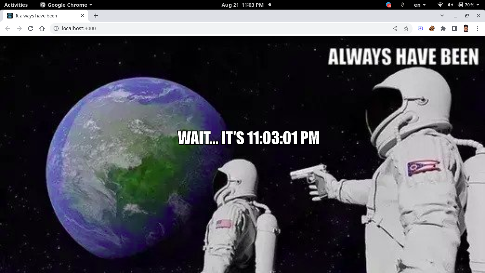

# Always has been
we tell time through the famous ** It alway has been ** meme. I was inspired when I was scrolling
over reddit and stumbled across [this](https://www.reddit.com/r/ArduinoProjects/comments/i06i30/eink_clock/) post. I don't think it will help anyone but its a good troll material.

**use desktop for better experience.*

# Origin and background as explained [here](https://www.dailydot.com/unclick/always-has-been-memes/)
The earliest known iterations of the “always has been” meme originally [popped up on a 4chan board(duh!)](https://i.4pcdn.org/pol/1533661215801.jpg) around 
August of 2018, according to [Know Your Meme](https://knowyourmeme.com/memes/wait-its-all-ohio-always-has-been), and involved crude MC-Paint style drawings. One version, which 
surged in popularity around late 2019, was [a spin on Ohio memes](https://www.reddit.com/r/IHateOhio/comments/e8tmev/fuck_fuck_fuck_fuck_its_all_ohio_shit/).

# [Preview](https://always-hasbeen-time.netlify.app/)

# MIT License (MIT)

Copyright (c) Yohannes Tezera

Permission is hereby granted, free of charge, to any person obtaining a copy of this software and associated documentation files (the "Software"), to deal in the Software without restriction, including without limitation the rights to use, copy, modify, merge, publish, distribute, sublicense, and/or sell copies of the Software, and to permit persons to whom the Software is furnished to do so, subject to the following conditions:

The above copyright notice and this permission notice shall be included in all copies or substantial portions of the Software.

THE SOFTWARE IS PROVIDED "AS IS", WITHOUT WARRANTY OF ANY KIND, EXPRESS OR IMPLIED, INCLUDING BUT NOT LIMITED TO THE WARRANTIES OF MERCHANTABILITY, FITNESS FOR A PARTICULAR PURPOSE AND NONINFRINGEMENT. IN NO EVENT SHALL THE AUTHORS OR COPYRIGHT HOLDERS BE LIABLE FOR ANY CLAIM, DAMAGES OR OTHER LIABILITY, WHETHER IN AN ACTION OF CONTRACT, TORT OR OTHERWISE, ARISING FROM, OUT OF OR IN CONNECTION WITH THE SOFTWARE OR THE USE OR OTHER DEALINGS IN THE SOFTWARE.